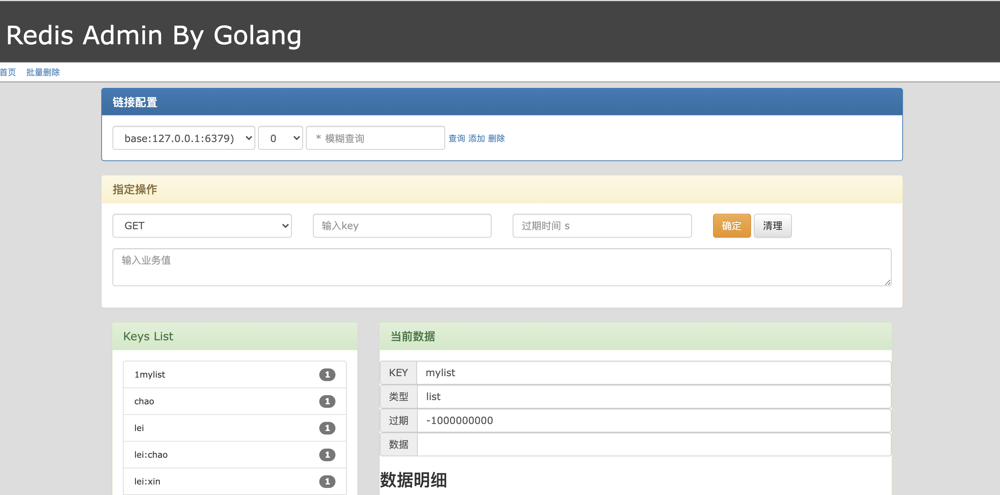

# redisAdmin
使用golang+html操作redis 信息/主要 增删改查


* 项目实现
1. 实际基本的登录控制
2. 实现基础的scan keys
3. 实现基本操作（后续待更新）

项目启动
```
go run main.go -env=local
```
浏览器打开网址
```
http://127.0.0.1:10110/assets/
```

项目容器化
可以参考cicd.txt
打包成镜像文件 直接发布

项目配置文件 config/local.toml
登录账户 login_user
服务端端口 transport

项目使用gin框架搭建，前端页面使用bootstrap+layerJS+JQuery 
## 服务组件 ## 
+ go-redis[github.com/go-redis/redis]
+ jwt-go[github.com/dgrijalva/jwt-go]
+ go-cache[github.com/patrickmn/go-cache]
+ zerolog[github.com/rs/zerolog]
+ viper[github.com/spf13/viper]
+ trace[github.com/opentracing/opentracing-go]
+ jaeger[github.com/uber/jaeger-client-go]
+ metrics[github.com/prometheus/client_golang]
+ system[github.com/shirou/gopsutil/v3]
+ overseer[github.com/jpillora/overseer]

CHANGE_LOG
|  版本   | 内容  |  时间 |
|  ----  | ----  |  --- |
| v0.0.1 | 初始化项目init | 2022-03-03 |
| v0.0.2 | 阶段2。0 | 2022-04-03 |
|    |   |    |
|    |   |    |


